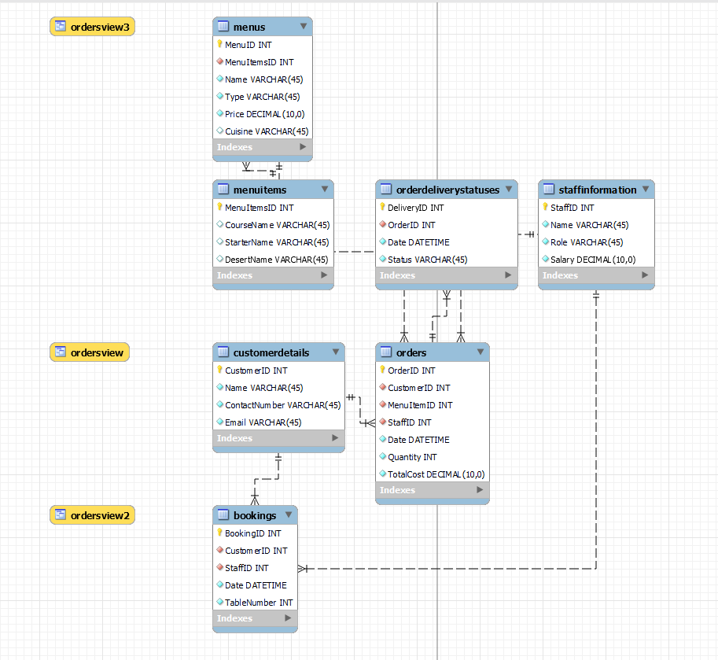

# Little Lemon Restaurant Management System
### Table of Contents
- [Little Lemon Restaurant Management System](#little-lemon-restaurant-management-system)
    - [Table of Contents](#table-of-contents)
  - [Project Description](#project-description)
  - [Entity-Relationship Diagram](#entity-relationship-diagram)
  - [Installation and Setup](#installation-and-setup)
  - [Stored Procedures](#stored-procedures)
  - [Data Analysis with Tableau](#data-analysis-with-tableau)

## Project Description

This project aims to manage the operations of Little Lemon, a fast-food restaurant. MySQL is utilized for database modeling, and Tableau is used for data analysis.

## Entity-Relationship Diagram

To view the Entity-Relationship Diagram, click here or see the image below.

## Installation and Setup

To install and set up the database, follow these steps:
- Install MySQL on your machine.
- Import the LittleLemonDB.sql file into MySQL Workbench.
  

## Stored Procedures

- **GetMaxQuantity()**: This stored procedure retrieves the maximum quantity of a specific item that has been ordered. It's useful for inventory management.

- **ManageBooking()**: This procedure allows you to manage table bookings for customers. It provides options to update or cancel bookings, ensuring better resource utilization.

- **UpdateBooking()**: This stored procedure updates the booking details in the database. It takes the booking ID and new booking date as parameters, making sure the changes are reflected in the system.

- **AddBooking()**: This procedure adds a new booking to the system. It accepts multiple parameters like booking ID, customer ID, booking date, and table number to complete the process.

- **CancelBooking()**: This stored procedure deletes a specific booking from the database, allowing for better management and freeing up resources.

## Data Analysis with Tableau
A Tableau workbook has been created, containing various charts and dashboards to facilitate data analysis. Download the workbook here.

